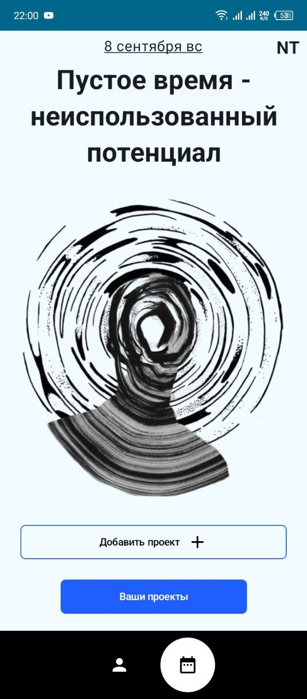
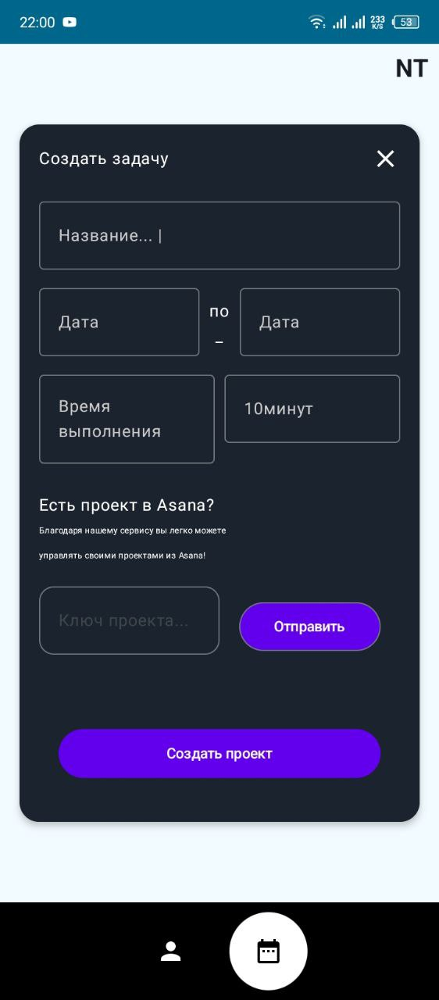
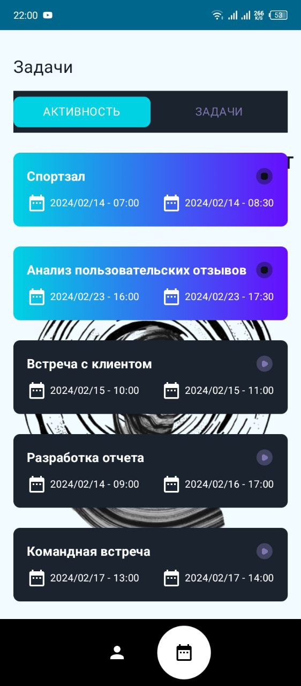
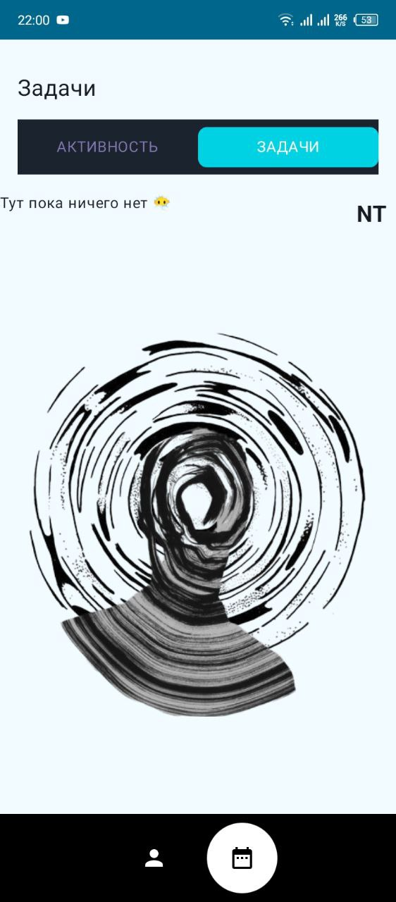
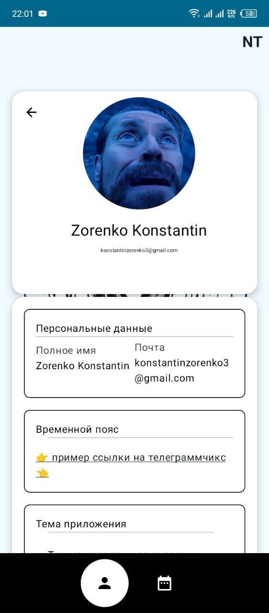
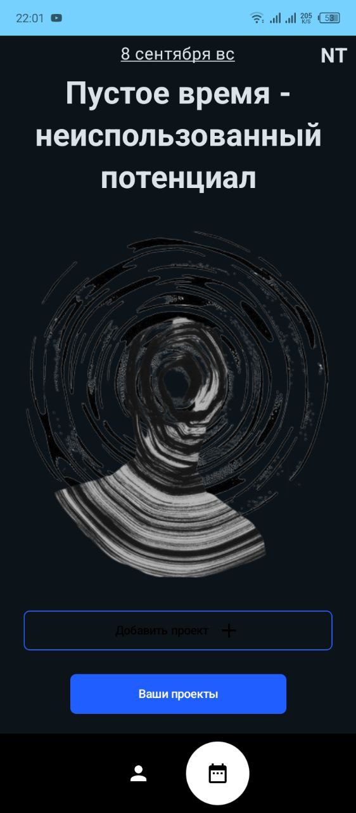
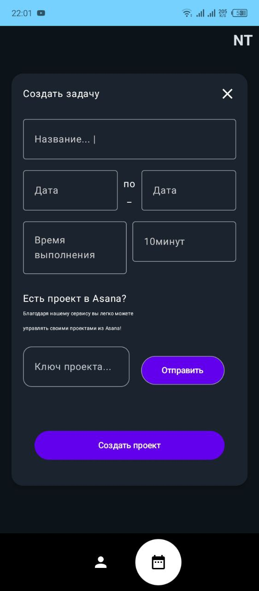
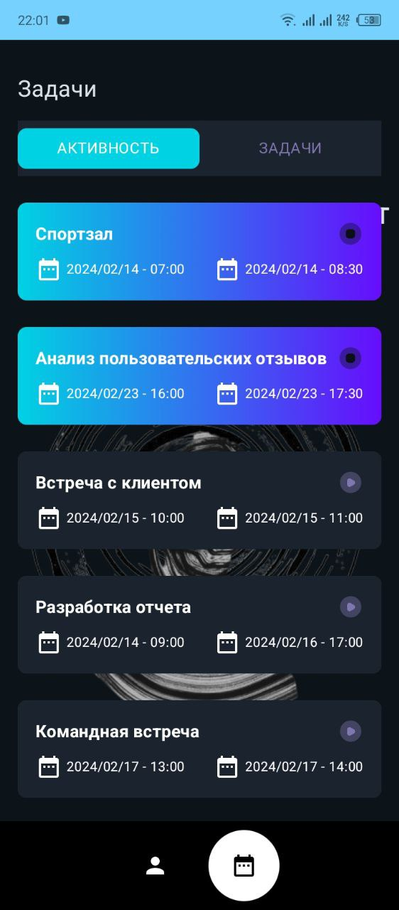
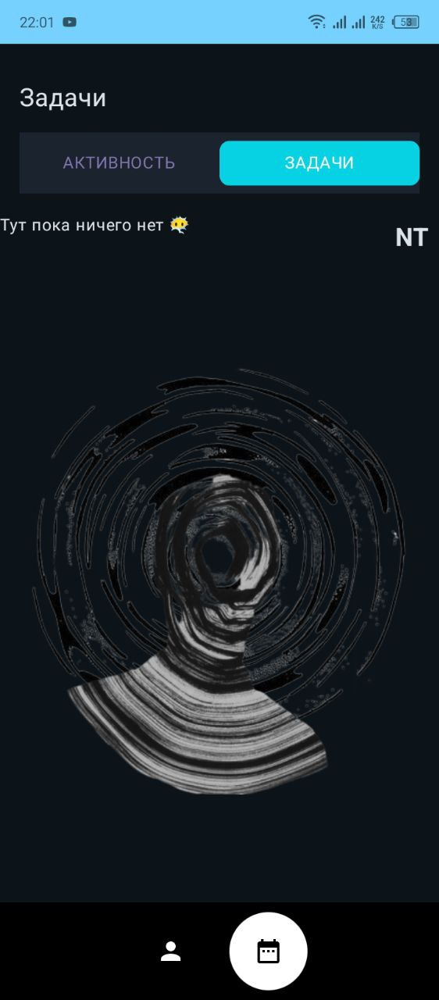
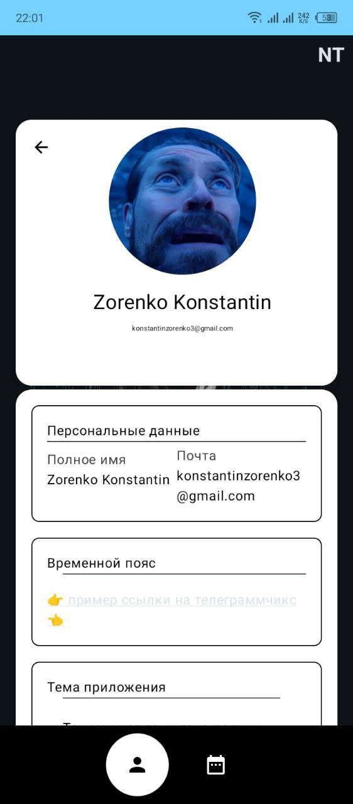

# Time Tracker Application

Это приложение было разработано в рамках кейса "Разработка сервиса для трекинга времени, затраченного на проект" (ООО "РНДСОФТ") на VIII Региональном хакатоне "RinHack".

## Оглавление
- [Описание](#описание)
- [Скриншоты](#скриншоты)
- [Используемые технологии](#используемые-технологии)
- [Установка](#установка)
- [Системные требования](#системные-требования)
- [Контакты](#контакты)
- [Лицензия](#контакты)

## Описание
**Time Tracker Application** — это приложение для трекинга времени, затраченного на созданную задачу в приложении. Само приложение подразумевает работу не только со своими личными задачми, но и отслеживанием затраченного времени роботников в организациях на поставленные задачи, группиорвку задач по группам для удобной сортировки своих планов.

## Скриншоты

### Светлая тема

  
  
  
  
  

### Темная тема

  
  
  
  
  

## Используемые технологии
| Технология                          | Описание                                                                                          | Статус |
|-------------------------------------|---------------------------------------------------------------------------------------------------|--------|
| **Room**                            | Локальная база данных                                                                             | ✅      |
| **Apollo (GraphQL)**                | Интеграция с API                                                                                  | ✅      |
| **OkHttp**                          | Клиент HTTP для сетевых запросов                                                                  | ✅      |
| **Jetpack Compose**                 | Фреймворк для создания пользовательского интерфейса                                               | ✅      |
| **Clean Architecture**              | Архитектурный шаблон                                                                              | ✅      |
| **MVVM (Model-View-ViewModel)**     | Паттерн проектирования                                                                            | ✅      |
| **UseCases**                        | Реализация бизнес-логики                                                                          | ✅      |
| **Dagger - Hilt DI**                | Внедрение зависимостей                                                                            | ✅      |
| **Data Store Preferences**          | Хранение access & refresh токенов, времени создания и окончания жизни access токена               | ✅      |
| **Тестирование**                    | Автоматическое тестирование                                                                       | ❌      | 
| **WorkManager & ForegroundService** | Управление задачами и фоновыми сервисами                                                          | ❌      |
| **Локализация**                     | Поддержка нескольких языков                                                                       | ❌      |
| **Google Authentication**           | Аутентификация в сервисы Google с помощью [One-Tap](https://github.com/stevdza-san/OneTapCompose) | ✅      |

## Установка
😶‍🌫️ Здесь в дальнейшем будет ссылка на скачивание приложения 😶‍🌫️

## Системные требования
- Android 6.0 (Marshmallow) или выше
- Интернет-соединение для синхронизации данных
- Минимум 2 GB оперативной памяти
   
## Контакты
- Backend Developer: [@jmblx](https://github.com/jmblx)
- Designer: [@ruruchin](https://github.com/ruruchin)
- Mobile Developer: [@bybuss](https://github.com/bybuss)

## Лицензия
😶‍🌫️ Этот проект пока не распространяется ни под какой лицензией, но скоро будет! 😶‍🌫️
